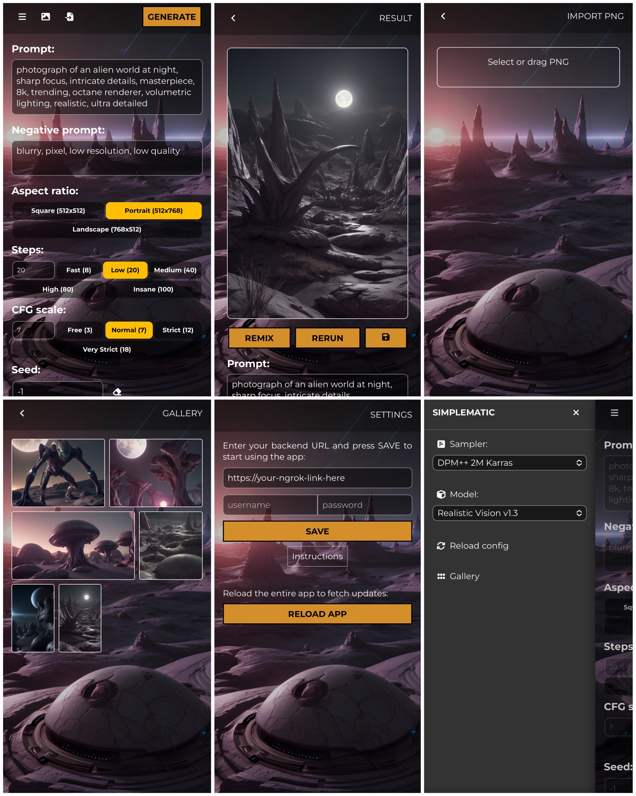

# Overview

This web app provides a simplified interface for using Stable Diffusion,
utilizing the API of [AUTOMATIC1111's Stable Diffusion Web UI](https://github.com/AUTOMATIC1111/stable-diffusion-webui).

The purpose is to deliver a watered-down feature set, making life easier
for beginners and anyone who is looking for a cleaner and simpler interface.

The app is served at https://simplematic.web.app

# Setup

This app requires a running instance of AUTOMATIC1111's Web UI.
The following command line arguments are necessary:

- `--api`: to enable API requests.
- `--share`: to create a Gradio public URL.
- OR `--ngrok your_ngrok_token`: to establish a tunnel using [ngrok](https://ngrok.com) service. (Not sponsored.)
- `--cors-allow-origins=https://simplematic.web.app`: to allow requests from this app.

You might want to add `--ngrok-region` to optimize connection speed.
See their [docs](https://ngrok.com/docs/platform/pops/) for more details.

Also, you can add `--api-auth username:password` to add a basic authorization layer.
Furthermore, add `--no-webui` to completely prevent other parties from using your instance.
But that also means you won't be able to use the Web UI either.

When the Web UI instance is ready, copy the provided Gradio or ngrok link and
paste it into the URL input in Settings screen. Enter username and password if
any, then click SAVE. If the setup is correct, the app will connect to your
instance and start fetching models as well as sampler list.

# Contribute

I don't have too much free time but will try to review issues and merge pull requests
that are useful and don't make too many changes.

# About me

My name's Cintam. I code to make a living and do arts to have a life.
I made this app to learn AI and other coding stuffs.
