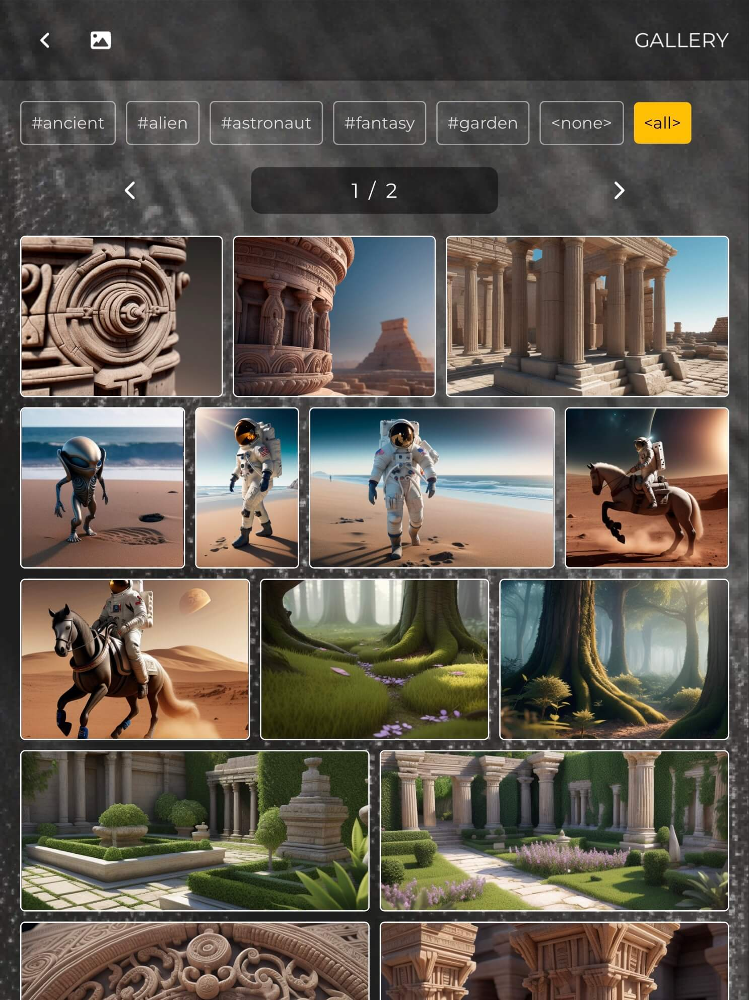
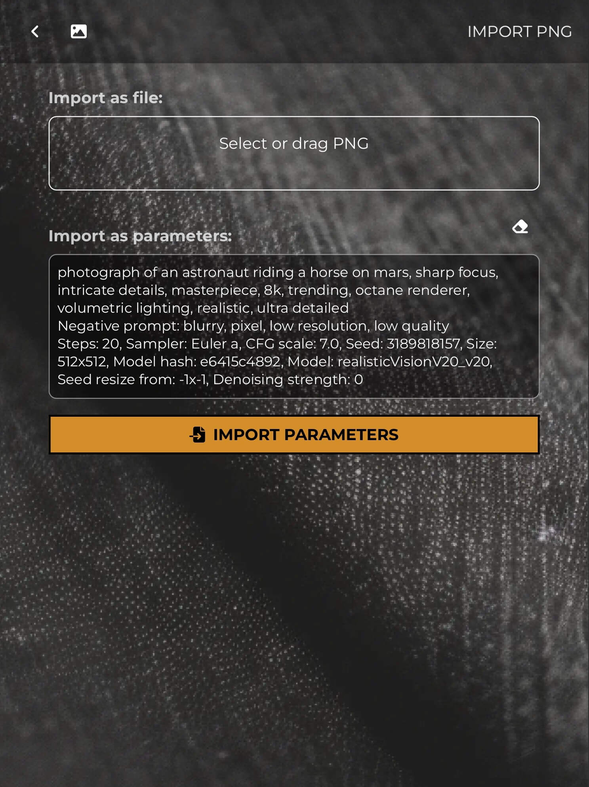

# Overview

This web app provides a simplified interface for using Stable Diffusion,
utilizing the API of [AUTOMATIC1111's Stable Diffusion Web UI](https://github.com/AUTOMATIC1111/stable-diffusion-webui).

The purpose is to deliver a watered-down feature set, making life easier
for beginners and anyone who is looking for a cleaner and simpler interface.

The app is served at https://simplematic.web.app

# Features

- Text-to-Image
  - Basic sizes.
  - Prompt, negative prompt, steps, CFG scale, seed, sampler (in side menu).
  - Face restoration.
  - HiRes upscaling (Latent).
- Image-to-Image
  - Upload an image or send from txt2img.
  - Supports denoising strength and 3 resize modes.
- Gallery
  - Save images along with parameters, including img2img's source image.
  - Hashtags filtering.
  - Pagination.
- Upscaler
  - Upload an image or send from txt2img.
  - Supports 1 and 2 upscalers with visibility.
  - Supports CodeFormer and GFPGAN visibilities.
- Import PNG & parameters.

## Screenshots

<p align="left">
  
  
  
  
  
  
  
  
</p>

# Setup

## Front-end

You can use the stable version of the app at https://simplematic.web.app

Alternatively, to manually host the app, please clone this repository
and run a static server at the `src` directory. Check-out the `main`
branch for stability, or `dev` branch for newest, unstable, features.

```bash
git clone https://github.com/DroganCintam/simplematic.git
cd simplematic

# For the latest (also unfinished, buggy) features
git checkout dev

# Run static server using NodeJS
npx http-server src -p 8080
# or using Python3
python3 -m http.server --directory src 8080
```

## Back-end

This app requires a running instance of AUTOMATIC1111's Web UI.
The following command line arguments are necessary:

- `--api`: to enable API requests.
- `--share`: to create a Gradio public URL.
- OR `--ngrok your_ngrok_token`: to establish a tunnel using [ngrok](https://ngrok.com) service. (Not sponsored.)
- `--cors-allow-origins=https://simplematic.web.app`: to allow requests from this app.

If you manually host the app, you may want to add your localhost URL to the
CORS origins list. For example:

- `--cors-allow-origins=https://simplematic.web.app,http://localhost:8000`

You might want to add `--ngrok-region` to optimize connection speed.
See their [docs](https://ngrok.com/docs/platform/pops/) for more details.

Also, you can add `--api-auth username:password` to add a basic authorization layer.
Furthermore, add `--no-webui` to completely prevent other parties from using your instance.
But that also means you won't be able to use the Web UI either.

When the Web UI instance is ready, copy the provided Gradio or ngrok link and
paste it into the URL input in Settings screen. Enter username and password if
any, then click SAVE. If the setup is correct, the app will connect to your
instance and start fetching models as well as sampler list.

# Contribute

I don't have too much free time but will try to review issues and merge pull requests
that are useful and don't make too many changes.

# About me

My name's Cintam. I code to make a living and do arts to have a life.
I made this app to learn AI and other coding stuffs.

If you enjoy my work and would like to support me, [buying me a coffee](https://ko-fi.com/cintam) would be greatly appreciated!
